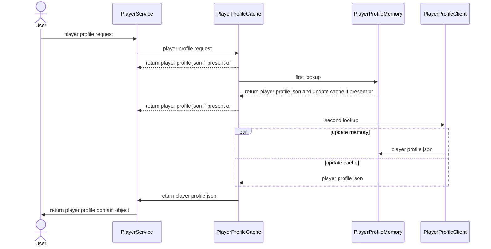
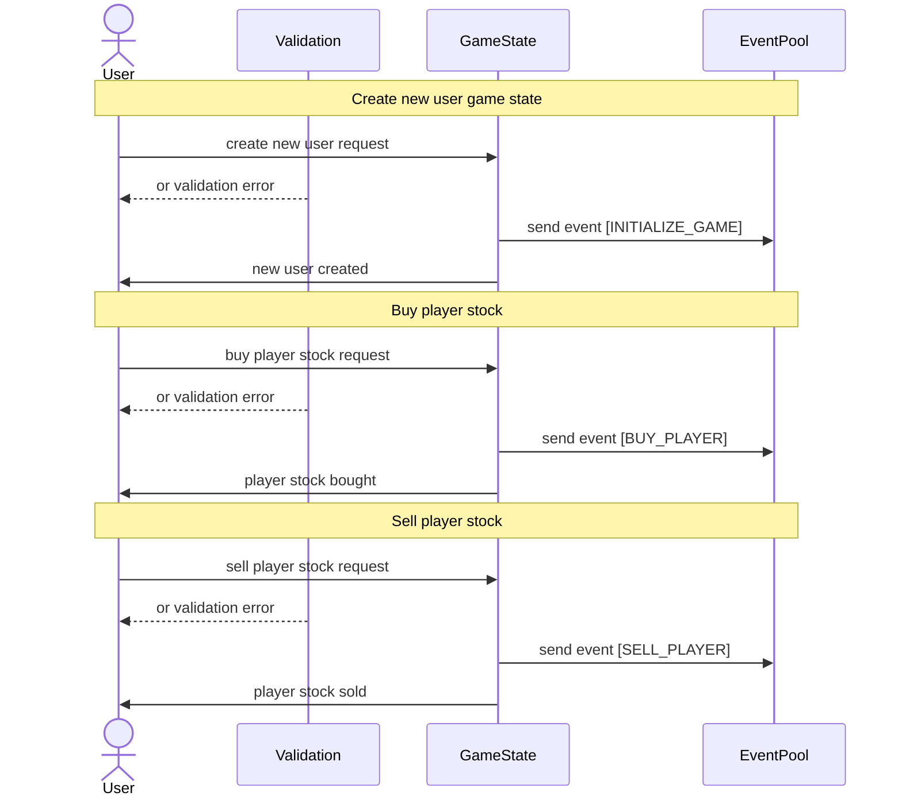

# FootballStock

### further improvement backend:

- readme content list and cleanup
- cleanup with decoders / encoders
- implement more test cases
- implement Integration Tests with local DynamoDb container (e.g. check optimistic locking conditions)
- architectural diagram
- design and add http endpoints
- add technical endpoints to check player memory and cache
- stream task to check all players from all user stats and send user event if price has changed
- read envs from cloud (aws credentials)
- create dynamoDb resources in cloud
- own instance for transfermarkt parser service - separate container
- authentication mechanism <- sth to study, separate table in dynamo?
- Future improvement - use MongoDb for json storage

### further improvement frontend:

- table for player search
- display player profile
- display user state
- button to buy/sell player

### API:

- users:
    - user state by user [GET]
    - buy stock for user [POST]
    - sell stock for user [POST]
    - user balance by user [GET]
    - user events by user [GET]
    - create new user [POST]

- players:
    - players search by string [GET]
    - player profile by id [GET]

- technical:
    - get all events [GET]
    - get all user states [GET]
    - db stats (number of records) [GET]
    - cache stats (number of records) [GET]

### DynamoDB Local

- use docker image:

  `docker pull amazon/dynamodb-local`

- run docker image (`-sharedDb` is i portant to share tables through all credentials/regions):

  `docker run -p 8000:8000 amazon/dynamodb-local -jar DynamoDBLocal.jar -inMemory -sharedDb`

- to create all tables locally from .json file definition run:

  ```aws dynamodb create-table --cli-input-json file://src/main/resources/playerProfileTable.json --endpoint-url http://localhost:8000```

  ```aws dynamodb create-table --cli-input-json file://src/main/resources/userGameStateTable.json --endpoint-url http://localhost:8000```

  ```aws dynamodb create-table --cli-input-json file://src/main/resources/eventTable.json --endpoint-url http://localhost:8000```

- to check whether tables has been created type:

  ```aws dynamodb list-tables --endpoint-url http://localhost:8000```

  ```aws dynamodb describe-table --table-name PlayerProfile --endpoint-url http://localhost:8000```

- to scan table:

  ```aws dynamodb scan --table-name PlayerProfile --endpoint-url http://localhost:8000```

### C4 diagram

### Player Profile Sequence diagram



### Player Search Sequence diagram

### User State Sequence diagram

